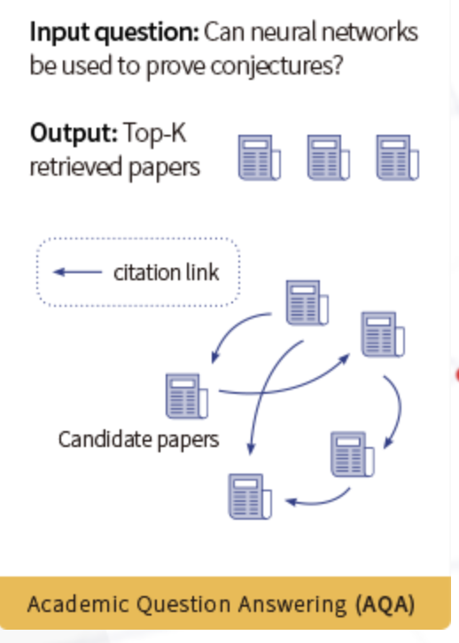

# Academic_Question_Answering-AQA-_KDD-2024

## AQA:
 Given professional questions and a pool of candidate papers, the objective is to retrieve the most relevant papers to answer these questions.

# Data: Description of Train/Valid and Other Files, Data Format, Dataset Size:

## `pid_to_title_abs_new.json` :
This dataset maps unique identifiers (pids) to papers. Each entry in the dataset follows the format: pid: {“title”: “abstract”:}
There are 352,651 papers in total.

## `qa_train.txt` :
The training dataset consists of dictionaries of questions. It contains 8757 entries. Each entry follows the format: {“question”: the general question,
“body”: specifications on the general question,
“pids”: ground-truth paper IDs provided for model training}

## `qa_valid_wo_ans.txt` :
The validation dataset follows the same format as the training dataset. It contains 2919 entries, and each entry is formatted as follows:
{“question”: the general question,
“body”: specifications on the general question }

## `result.txt` :
This file is a submission example file for validation. Participants are required to upload a text file that returns pids of papers that match the questions in qa_valid_wo_ans.txt. Each line in the submission file should contain the top 20 pids that best match the specific question provided in that line. The file should be in the .txt format. Please split the pids in each line with English commas. In addition, participants are allowed to use the large-scale open academic graph dataset OAG (https://open.aminer.cn/article? id=5965cf249ed5db41ed4f52bf) and the paper citation dataset DBLP Citation (https://open.aminer.cn/article? id=655db2202ab17a072284bc0c).

## Note: 
Participants are not allowed to use data other than those mentioned on this page.